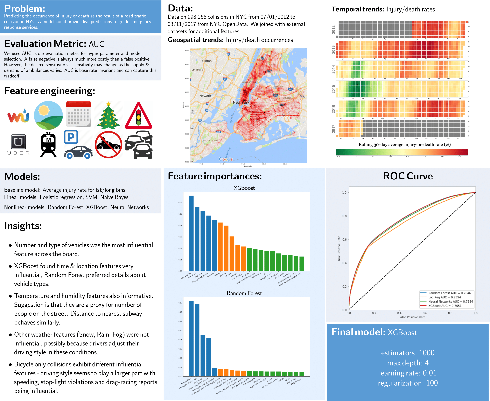

# Machine Learning Project

## Goal

* Predict car collisions in New York City.
* Understand the reasons that leads to collisions from data.

## Data

* NYPD collision history
* Uber drivers data for traffic estimation
* Weather
* Holidays

## Presentation

